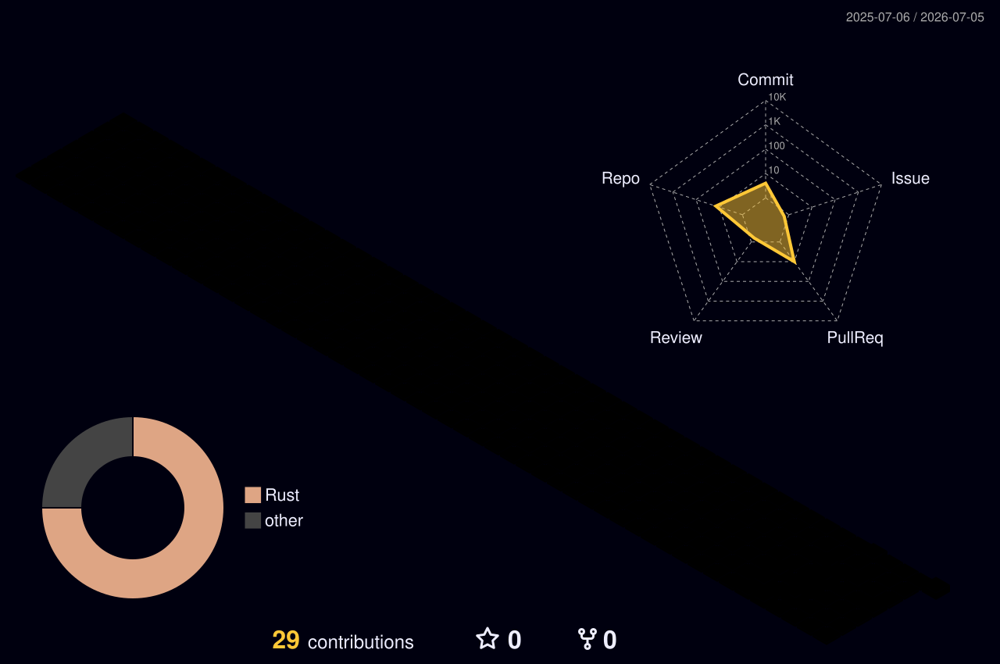

<div align="center">
  <picture>
    <source media="(prefers-color-scheme: light)" srcset="assets/banner-light.svg" />
    <source media="(prefers-color-scheme: dark)" srcset="assets/banner.svg" />
    
  </picture>
</div>

<div align="center">
  
</div>

<br/>

```bash
$ whoami
BitWeaverDev

$ cat clearance.txt
ROLE      : CISO Dept @ ABN AMRO
MISSION   : Securing distributed systems at scale
DOCTRINE  : Zero-Trust — never trust, always verify
LOCATION  : Utrecht, The Netherlands

$ ./scan_stack.sh --deep
[OK] python        interpreter armed
[OK] golang        binaries compiled
[OK] rust          memory-safe binaries compiled
[OK] azure         perimeter mapped
[OK] bicep         infra declared, no drift
[OK] terraform     state locked, plan verified
[OK] helm          releases pinned & signed
[OK] kubernetes    workloads isolated
[OK] zero-trust    policy: DEFAULT DENY
scan complete — 0 implicit trusts found
```

<div align="center"></div>

### 🛠️ Toolchain

<table align="center">
<tr><td align="center" width="140"><sub><b>LANGUAGES</b></sub></td><td>


</td></tr>
<tr><td align="center"><sub><b>CLOUD & IaC</b></sub></td><td>


</td></tr>
<tr><td align="center"><sub><b>PLATFORM & OPS</b></sub></td><td>


</td></tr>
</table>

<div align="center"></div>

### 📊 Live Activity

<div align="center">

<picture>
  <source media="(prefers-color-scheme: dark)" srcset="https://raw.githubusercontent.com/BitWeaverDev/BitWeaverDev/output/github-contribution-grid-snake-dark.svg" />
  <source media="(prefers-color-scheme: light)" srcset="https://raw.githubusercontent.com/BitWeaverDev/BitWeaverDev/output/github-contribution-grid-snake.svg" />
  
</picture>

</div>

<table align="center">
<tr>
<td align="center" width="50%">

<picture>
  <source media="(prefers-color-scheme: dark)" srcset="profile-3d-contrib/profile-night-rainbow.svg" />
  <source media="(prefers-color-scheme: light)" srcset="profile-3d-contrib/profile-green-animate.svg" />
  
</picture>

</td>
<td align="center" width="50%">


</td>
</tr>
</table>

<div align="center">


</div>

<div align="center"></div>

<div align="center">

### 📡 Connect

[](https://github.com/BitWeaverDev)
[](https://www.linkedin.com/in/ashkan-hadadi)

</div>

<div align="center">
  <picture>
    <source media="(prefers-color-scheme: light)" srcset="assets/footer-light.svg" />
    <source media="(prefers-color-scheme: dark)" srcset="assets/footer.svg" />
    
  </picture>
</div>
