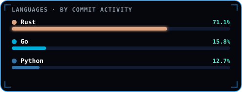

  <picture>
    <source media="(prefers-color-scheme: light)" srcset="assets/banner-light.svg" />
    <source media="(prefers-color-scheme: dark)" srcset="assets/banner.svg" />
    
  </picture>

 

  <picture>
    <source media="(prefers-color-scheme: light)" srcset="assets/terminal-light.svg" />
    <source media="(prefers-color-scheme: dark)" srcset="assets/terminal.svg" />
    
  </picture>

  <picture>
    <source media="(prefers-color-scheme: light)" srcset="assets/divider-light.svg" />
    <source media="(prefers-color-scheme: dark)" srcset="assets/divider.svg" />
    
  </picture>

### 🛠️ Stack

<b>LANGUAGES</b> 
 
<b>CLOUD & IaC</b> 
 
<b>PLATFORM & OPS</b> 

 

<picture>
  <source media="(prefers-color-scheme: dark)" srcset="assets/languages.svg" />
  <source media="(prefers-color-scheme: light)" srcset="assets/languages-light.svg" />
  
</picture>

<i>Computed from my real commit history across contributed repositories — refreshed daily.</i>

  <picture>
    <source media="(prefers-color-scheme: light)" srcset="assets/divider-light.svg" />
    <source media="(prefers-color-scheme: dark)" srcset="assets/divider.svg" />
    
  </picture>

### 🌐 Open Source Contributions

<!-- CONTRIB-LIST:START -->
| Repository | Merged PRs |
|---|---|
| [**pola-rs/polars**](https://github.com/pola-rs/polars) | 3 |
| [**MatthewMckee4/karva**](https://github.com/MatthewMckee4/karva) | 2 |
| [**astral-sh/ruff**](https://github.com/astral-sh/ruff) | 1 |
| [**astral-sh/uv**](https://github.com/astral-sh/uv) | 1 |
<!-- CONTRIB-LIST:END -->

  <picture>
    <source media="(prefers-color-scheme: light)" srcset="assets/divider-light.svg" />
    <source media="(prefers-color-scheme: dark)" srcset="assets/divider.svg" />
    
  </picture>

  <picture>
    <source media="(prefers-color-scheme: light)" srcset="assets/footer-light.svg" />
    <source media="(prefers-color-scheme: dark)" srcset="assets/footer.svg" />
    
  </picture>

