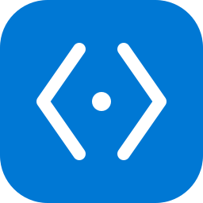
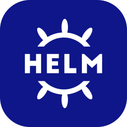
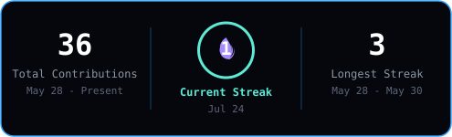

<div align="center">
  <picture>
    <source media="(prefers-color-scheme: light)" srcset="assets/banner-light.svg" />
    <source media="(prefers-color-scheme: dark)" srcset="assets/banner.svg" />
    
  </picture>
</div>

<br/>

```bash
$ whoami
BitWeaverDev

$ cat clearance.txt
ROLE      : CISO Dept @ ABN AMRO
MISSION   : Securing distributed systems at scale
DOCTRINE  : Zero-Trust — never trust, always verify
LOCATION  : Utrecht, The Netherlands
```

<div align="center">
  <picture>
    <source media="(prefers-color-scheme: light)" srcset="assets/divider-light.svg" />
    <source media="(prefers-color-scheme: dark)" srcset="assets/divider.svg" />
    
  </picture>
</div>

### 🛠️ Toolchain

<div align="center">
<sub><b>LANGUAGES</b></sub><br/>
<br/>
<sub><b>CLOUD & IaC</b></sub><br/>
<br/>
<sub><b>PLATFORM & OPS</b></sub><br/>

</div>

<div align="center">
  <picture>
    <source media="(prefers-color-scheme: light)" srcset="assets/divider-light.svg" />
    <source media="(prefers-color-scheme: dark)" srcset="assets/divider.svg" />
    
  </picture>
</div>

### 📊 Live Activity

<div align="center">

<picture>
  <source media="(prefers-color-scheme: dark)" srcset="https://raw.githubusercontent.com/BitWeaverDev/BitWeaverDev/output/github-contribution-grid-snake-dark.svg" />
  <source media="(prefers-color-scheme: light)" srcset="https://raw.githubusercontent.com/BitWeaverDev/BitWeaverDev/output/github-contribution-grid-snake.svg" />
  
</picture>

<br/>

<picture>
  <source media="(prefers-color-scheme: dark)" srcset="assets/streak.svg" />
  <source media="(prefers-color-scheme: light)" srcset="assets/streak-light.svg" />
  
</picture>

</div>

<div align="center">
  <picture>
    <source media="(prefers-color-scheme: light)" srcset="assets/divider-light.svg" />
    <source media="(prefers-color-scheme: dark)" srcset="assets/divider.svg" />
    
  </picture>
</div>

### 🌐 Open Source Contributions

<!-- CONTRIB-LIST:START -->
- [kubernetes/kubernetes](https://github.com/kubernetes/kubernetes) — Production-Grade Container Scheduling and Management
- [astral-sh/uv](https://github.com/astral-sh/uv) — An extremely fast Python package and project manager, written in Rust.
- [astral-sh/ruff](https://github.com/astral-sh/ruff) — An extremely fast Python linter and code formatter, written in Rust.
- [pola-rs/polars](https://github.com/pola-rs/polars) — Extremely fast Query Engine for DataFrames, written in Rust
- [j178/prek](https://github.com/j178/prek) — ⚡ A fast Git hook manager written in Rust, designed as a drop-in alternative to pre-commit, reimagined.
- [hashicorp/terraform-provider-azurerm](https://github.com/hashicorp/terraform-provider-azurerm) — Terraform provider for Azure Resource Manager
- [MatthewMckee4/karva](https://github.com/MatthewMckee4/karva) — An extremely fast Python test framework, written in Rust. 
<!-- CONTRIB-LIST:END -->

<div align="center">
  <picture>
    <source media="(prefers-color-scheme: light)" srcset="assets/divider-light.svg" />
    <source media="(prefers-color-scheme: dark)" srcset="assets/divider.svg" />
    
  </picture>
</div>

<div align="center">

### 📡 Connect

[](https://github.com/BitWeaverDev)
[](https://www.linkedin.com/in/ashkan-hadadi)

</div>

<div align="center">
  <picture>
    <source media="(prefers-color-scheme: light)" srcset="assets/footer-light.svg" />
    <source media="(prefers-color-scheme: dark)" srcset="assets/footer.svg" />
    
  </picture>
</div>
